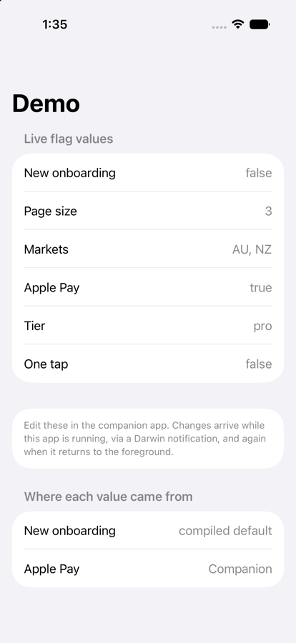
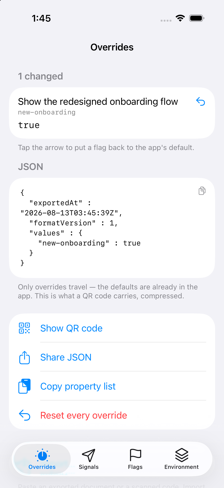

# FeatureFlag

[](https://github.com/andyyhope/FeatureFlag/actions/workflows/ci.yml)
[](https://swift.org)
[](#requirements)
[](LICENSE)

Declare feature flags as Swift properties, read them type-safely, and edit them from a
separate companion app that never links a line of your code.

```swift
import FeatureFlag

@FlagContainer
struct AppFlags {

    @Flag(default: false, description: "Show the redesigned onboarding",
          remoteKey: "featureToggles.onboarding.v2")
    var newOnboarding: Bool

    @FlagGroup(description: "Checkout")
    var checkout: CheckoutFlags
}

@FlagContainer
struct CheckoutFlags {

    @Flag(default: false, description: "Offer Apple Pay")
    var applePay: Bool

    @Flag(default: Tier.free, description: "Pricing tier to present")
    var tier: Tier
}

enum Tier: String, FlagValue, CaseIterable, FlagValueCases {
    case free, pro
}
```

```swift
let flags = FlagPole(
    AppFlags.self,
    sources: [
        UserDefaultsSource(appGroup: "group.example.flags")!,   // companion app edits
        RemoteOverrideSource(AppFlags.self),                    // your backend
    ]
)

if flags.checkout.applePay { … }
```

## Installation

Add the package in Xcode via **File → Add Package Dependencies**, or in `Package.swift`:

```swift
.package(url: "https://github.com/andyyhope/FeatureFlag.git", .upToNextMinor(from: "0.7.0"))
```

Pre-1.0, `from:` would accept every breaking `0.x` bump. While the API is still moving,
`.upToNextMinor` is the constraint that matches what this package promises.

Then add `FeatureFlag` to your app target. Add `FeatureFlagUI` **only** to a companion
app — your shipping app never needs it, and never links it in the example.

## Requirements

Swift 5.9+, iOS 16 / macOS 13 / tvOS 16 / watchOS 9. Builds in Swift 5 language mode, so
adopting it does not drag you through a Swift 6 concurrency migration.

`FeatureFlagUI` is iOS and macOS only. watchOS has no `Menu`, `TextEditor` or bordered
text field, and a flag editor on a watch is not a real use case, so on other platforms it
compiles to nothing rather than pretending. The core module supports all four.

## What you get

- **Nested flags.** `@FlagGroup` namespaces keys — `checkout.express.one-tap`. Nesting is
  namespacing only: a child's value never depends on its parent, so there is no
  evaluation order to reason about.
- **Every type `UserDefaults` supports**, plus arrays, dictionaries, and
  `RawRepresentable` enums, which need no implementation beyond declaring conformance.
- **Records.** `@FlagRecord` gives a flag a list of fixed-shape values — a name, a URL and
  a switch, repeated — with a field-by-field editor in the companion app.
- **A companion app** sharing flags through an App Group, updating your app while it runs.
- **Remote overrides** from JSON or PLIST, mapped from whatever shape your backend sends.
- **Export and import** as JSON, PLIST, or a QR code.
- **Combine** publishers per flag, and `ObservableObject` for SwiftUI.

## The idea that makes it work

`@FlagContainer` generates `static var flagDescriptors` — a description of the flag tree
available **without an instance and without reflection**.

Everything else falls out of that. Your app writes those descriptors to a shared
container as a schema document; the companion reads it and renders an editor for an app
whose types it has never seen. One companion build works for any app that publishes a
schema. Remote key mapping, strict payload validation and editor selection all read the
same descriptors.

## Documentation

The detailed docs are DocC catalogs, with a worked example for every feature. Read them in
Xcode (**Product → Build Documentation**) or right here on GitHub:

| | |
|---|---|
| [Getting started](Sources/FeatureFlag/FeatureFlag.docc/GettingStarted.md) | Empty project to a flag you can toggle from a second app |
| [Declaring flags](Sources/FeatureFlag/FeatureFlag.docc/DeclaringFlags.md) | Containers, nesting, keys, and flags with no pole behind them |
| [Flag values](Sources/FeatureFlag/FeatureFlag.docc/FlagValues.md) | The types a flag can hold, enums, and conforming your own |
| [Records](Sources/FeatureFlag/FeatureFlag.docc/RecordFlags.md) | Lists of fixed-shape values, and how they stay editable |
| [Sources and precedence](Sources/FeatureFlag/FeatureFlag.docc/SourcesAndPrecedence.md) | Stacking sources, and finding out which one won |
| [Observing changes](Sources/FeatureFlag/FeatureFlag.docc/ObservingChanges.md) | Combine publishers, SwiftUI, and changes from another process |
| [Remote overrides](Sources/FeatureFlag/FeatureFlag.docc/RemoteOverrides.md) | Dot paths, custom mappers, and why a bad field rejects everything |
| [Sharing with a companion app](Sources/FeatureFlag/FeatureFlag.docc/SharingWithACompanionApp.md) | What the schema carries, and what it costs |
| [Exporting and importing](Sources/FeatureFlag/FeatureFlag.docc/ExportingAndImporting.md) | JSON, property lists and QR codes |
| [Sending signals to the host](Sources/FeatureFlag/FeatureFlag.docc/SendingSignals.md) | One-way instructions from the companion to a running app |
| [Building a companion app](Sources/FeatureFlagUI/FeatureFlagUI.docc/BuildingACompanionApp.md) | An editor for another app's flags, in about thirty lines |
| [Troubleshooting](Sources/FeatureFlag/FeatureFlag.docc/Troubleshooting.md) | The failures worth recognising on sight |

Every sample in those articles is compiled and run by the test suite. Documentation that
has drifted from the API is worse than none, and nothing else would notice.

To build the archives yourself:

```sh
swift package generate-documentation --target FeatureFlag --target FeatureFlagUI
```

The rest of this README is the shape of the thing. The articles are where the detail is.

## Precedence

Sources are asked in order, so the order of the stack *is* the precedence:

```
1. local overrides    (companion app, imported JSON or QR)
2. remote payload     (your backend)
3. compiled default   (@Flag(default:))
```

A value you set by hand stays set until you clear it — which is what makes the companion
trustworthy for QA. `resolution(for:)` names the source that won:

```swift
flags.resolution(for: flags.flags.$newOnboarding).sourceName   // "App Group", or nil for the default
```

That is the answer to "why is this flag false?".

## Remote overrides

The framework decodes; it never fetches. Your app gets configuration however it likes and
hands over the bytes, so no networking, auth, retry or cache invalidation lives in a flag
library:

```swift
let (data, _) = try await URLSession.shared.data(from: url)
try remote.apply(data, format: .json)
```

Flags say where they live in the payload with `remoteKey`, read as a dot path
(`experiments.0.enabled` indexes into arrays). For a shape no path can address — a list of
records, say — implement `RemoteOverrideMapper`.

Applying is strict and all-or-nothing: one bad field rejects the payload and reports every
problem at once, rather than leaving your app running on half a configuration.

One deliberate allowance: JSON has a single number type, so a whole number satisfies a
`Double` flag. That is exact widening, not coercion — `"true"` is still not a boolean.

→ [Remote overrides](Sources/FeatureFlag/FeatureFlag.docc/RemoteOverrides.md) covers
custom mappers, the enum-case check, and what a successful apply reports.

## The companion app

Your app publishes its schema on launch:

```swift
try flags.publishSchema(appGroup: "group.example.flags")
```

The companion renders it, linking none of your code:

```swift
import FeatureFlagUI

@main
struct CompanionApp: App {
    var body: some Scene {
        WindowGroup {
            FlagCompanionView(appGroup: "group.example.flags")
        }
    }
}
```

That is the whole app, not a sketch of one. It opens the shared store, reports the two
ways that can fail with something someone can act on, and gives you Overrides and Flags
as tabs.

Tabs are a list you compose, so a companion takes only what it needs:

```swift
FlagCompanionView(
    appGroup: "group.example.flags",
    tabs: [.overrides, .signals(AppSignal.self, appGroup: "group.example.flags"), .flags]
)
```

`.signals` is opt-in — it needs your signal enum, so an app without one simply leaves it
out. `.detail(key:title:)` promotes a single flag to its own screen, for the one whose
consequence earns it. `.custom(id:title:symbol:)` puts your own screens in the same list,
handed the same store.

Signals can be filed by type once there are enough of them to be worth it, and each group
stays a real Swift boundary — the host switches over one enum at a time:

```swift
.signals([
    .group("Configuration", ConfigSignal.self),
    .group("Caches", CacheSignal.self),
], appGroup: "group.example.flags")
```

Edits reach your running app through a Darwin notification, because
`UserDefaults.didChangeNotification` does **not** fire for writes made by another process.
Sources also re-read on foreground, covering the case where your app was suspended and
missed one.

→ [Building a companion app](Sources/FeatureFlagUI/FeatureFlagUI.docc/BuildingACompanionApp.md)
has the whole app, and
[Sharing with a companion app](Sources/FeatureFlag/FeatureFlag.docc/SharingWithACompanionApp.md)
explains what the schema carries.

The companion can also send one-way instructions — "re-fetch the remote config", "purge
the cache" — to a running host: see
[Sending signals to the host](Sources/FeatureFlag/FeatureFlag.docc/SendingSignals.md).

## Reading from other threads

`FlagPole` is not `@MainActor`. Reads are lock-protected and safe from any thread, because
apps read flags off the main thread constantly. Only `objectWillChange` is delivered on
the main thread, so SwiftUI observation stays correct.

## Three things worth knowing

**Export spans the whole stack.** `overrides`, and everything built on it, carries any
value that is not the compiled default — including one a remote payload supplied.
Exporting from a device with remote config and importing elsewhere turns those into local
overrides on the receiving device. Usually what you want from "reproduce this device's
state", but worth knowing before you share a code.

**`pole.someFlag` is a convenience, not the whole API.** Real members win over dynamic
member lookup, so a flag named `flags`, `keys`, `schema`, `overrides` or `descriptors` is
reached as `pole.flags.yourFlag`. Everything still works; only the shorthand is
unavailable for those five names.

**If your own module declares a type called `Flag`**, write `@FeatureFlag.Flag` instead. A
local `Flag` makes the bare attribute fail before any macro runs. Everything generated is
fully qualified, so nothing else can be shadowed.

**A flag can hold a list of records** when configuration is not one value but several
small structured ones:

```swift
@FlagRecord
struct PaymentMethod {
    var name: String
    var kind: PaymentKind      // an enum field becomes a picker in the companion
    var enabled: Bool
}

@Flag(default: [PaymentMethod(name: "Visa", kind: .card, enabled: true)],
      description: "Payment methods offered at checkout")
var paymentMethods: FlagRecords<PaymentMethod>
```

Stored as JSON text, so every codec, the QR encoder and remote validation already handle
it — and a companion built before records existed degrades to a text field rather than
failing to read the schema. Adding a field to a record invalidates lists already stored:
the app falls back to its default rather than reading a half-built value.
See [Records](Sources/FeatureFlag/FeatureFlag.docc/RecordFlags.md).

→ [Troubleshooting](Sources/FeatureFlag/FeatureFlag.docc/Troubleshooting.md) has the rest,
including the `UserDefaults` type-caching behaviour that only bites if a flag changes its
Swift type while keeping its key.

## Example

[`Examples/FeatureFlagExamples.xcodeproj`](Examples/README.md) contains two iOS apps
sharing an App Group — a host that declares flags and a companion that edits them. Open it
and run `DemoApp`, then `DemoCompanion`.

| Host app | Companion app |
|---|---|
|  |  |

## Credit where it is due

This framework is inspired by [**Vexil**](https://github.com/unsignedapps/Vexil) by
[Unsigned Apps](https://github.com/unsignedapps) — the best-established Swift feature flag
library, and worth using directly if it fits your needs. Several ideas here are Vexil's:
the `FlagPole` as the thing you read flags through, `@Flag` and `@FlagGroup` as property
wrappers, containers that namespace by nesting, and an ordered stack of `FlagValueSource`s
where position decides precedence.

No code was copied — this is an independent implementation, and both projects are MIT
licensed. Where the two differ, it is because this one was built to different
requirements:

| | Vexil | FeatureFlag |
|---|---|---|
| Companion UI | Vexillographer links your concrete flag types | Renders from a published schema, links none of your code |
| Streaming | `AsyncSequence` | Combine publishers |
| Language mode | Swift 6 tooling | Swift 5, no concurrency migration required |
| Remote config | — | `remoteKey` dot paths, custom mappers, strict validation |
| Transport | — | JSON, PLIST and QR export/import |

The decoupled companion is the reason this exists. Vexillographer is an excellent tool,
but it has to be built alongside the app it edits. Publishing a schema instead means one
companion build can edit any app that publishes one — at the cost of everything the editor
shows having to survive a trip through JSON.

## Status and contributing

Early. 533 tests, but the API may still move before 1.0. Issues and pull requests are
welcome — if you are reporting a bug, a failing test says more than a description.

## License

MIT. See [LICENSE](LICENSE).
